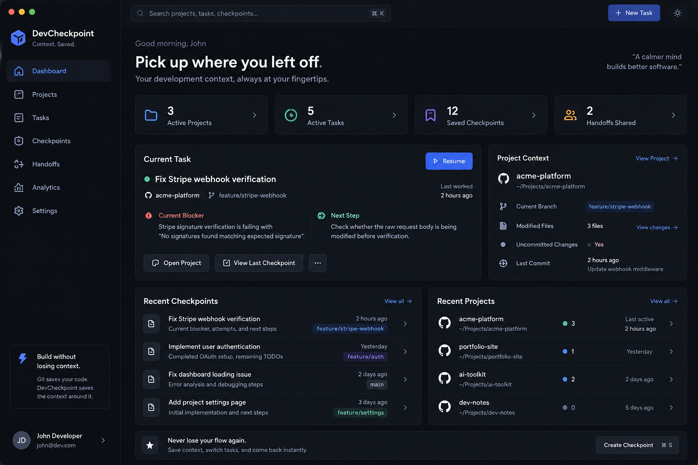
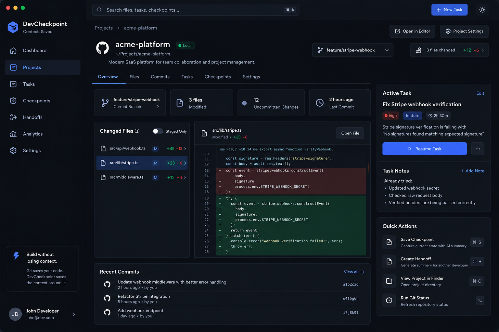
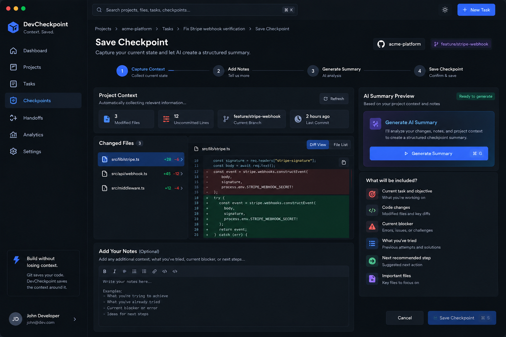
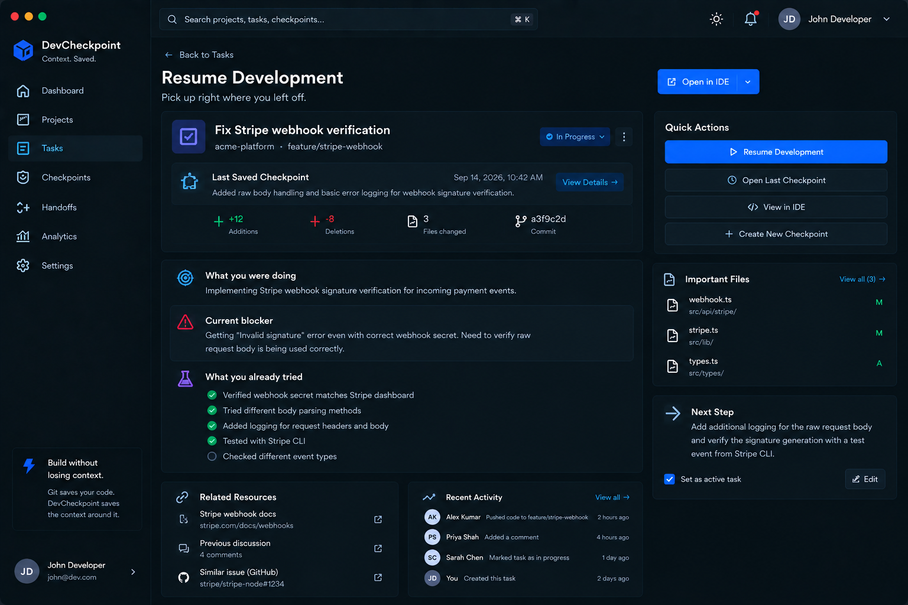
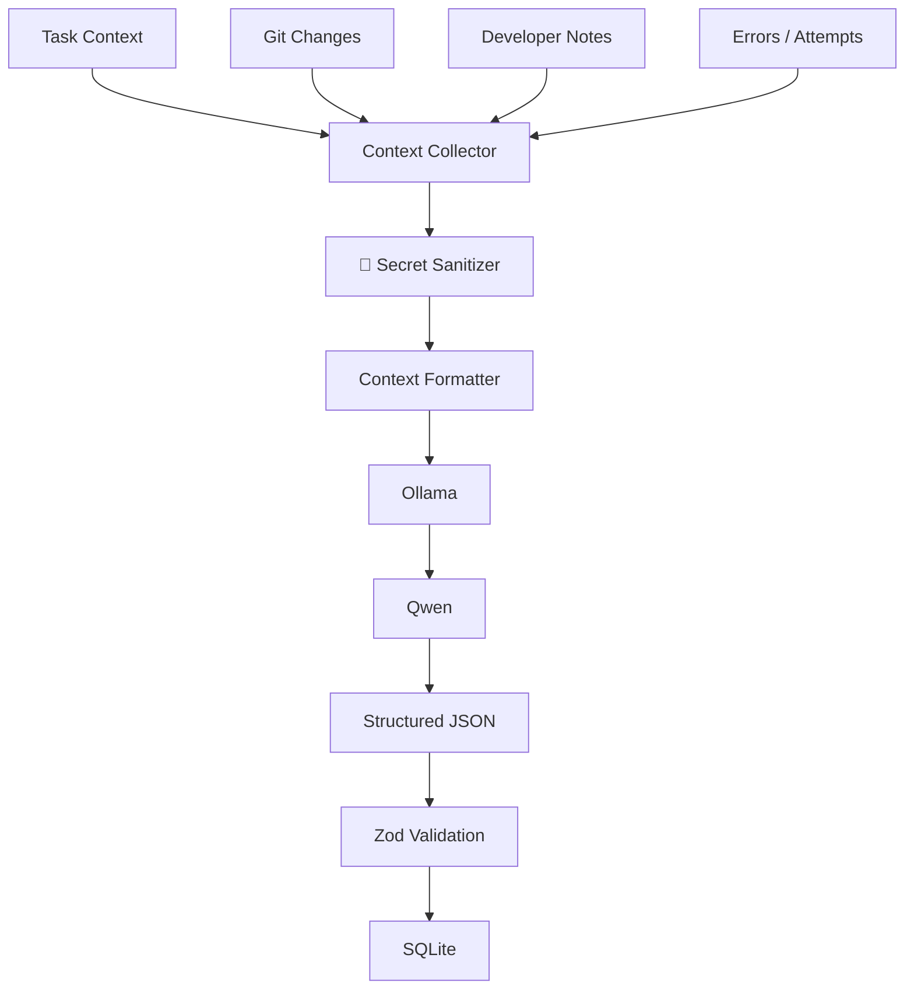
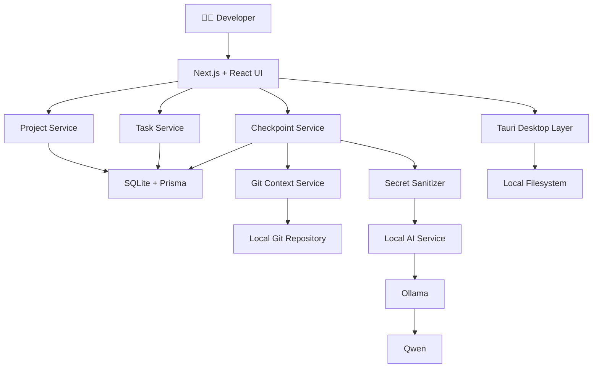
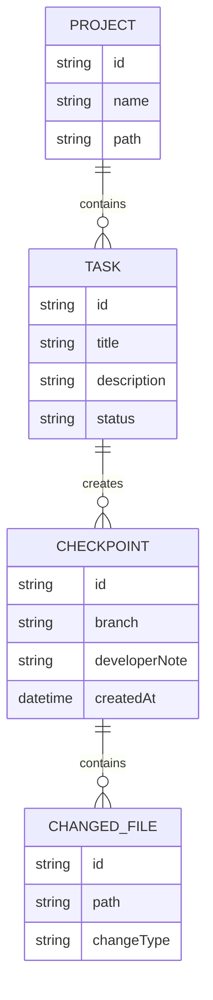

<div align="center">

# ⚡ DevCheckpoint

### Your development context, saved.


<br/>

**A local-first developer productivity tool that remembers what you were working on,  
what changed, what broke, what you already tried, and what you should do next.**

<br/>

[](#-hackathon-track)
[](#-hackathon-track)
[](#-privacy--local-first)
[](https://tauri.app/)
[](https://nextjs.org/)
[](https://www.typescriptlang.org/)

<br/>

### Git saves your code. DevCheckpoint saves the context around your code.

</div>

---

# 🧠 What is DevCheckpoint?

Developers don't only lose time writing code.

They lose time **remembering what they were doing**.

You might be debugging an authentication issue, get interrupted by a production bug, attend a meeting, switch repositories, or simply return the next morning.

Git can tell you:

```text
3 files changed
17 insertions
6 deletions
```

But it usually cannot tell you:

```text
Why did I change those files?
What exactly was broken?
What have I already tried?
Which files actually matter?
What was I planning to do next?
```

**DevCheckpoint fills that gap.**

It creates a structured checkpoint of your current development state so you can return later and continue without reconstructing your entire mental context.

> **Think of DevCheckpoint as a save-state system for software development.**

---

# 🎯 The Problem

Imagine you're debugging a Stripe webhook.

You have already:

- changed the webhook handler
- tested a different endpoint secret
- inspected request headers
- modified middleware
- discovered that signature verification is still failing

Then an urgent issue appears.

You switch tasks.

A few hours later, you return.

Git shows you the files you changed, but the reasoning behind those changes is no longer immediately available.

You now have to rebuild the entire context in your head.

DevCheckpoint is designed to eliminate that restart cost.

---

# ⚡ Core Workflow

```mermaid
flowchart LR
    A["📁 Select Repository"]
    B["🎯 Start Task"]
    C["💻 Work Normally"]
    D["💾 Save Checkpoint"]
    E["🌿 Collect Git Context"]
    F["🔐 Sanitize Context"]
    G["🤖 Local AI"]
    H["🗄️ Save Locally"]
    I["▶ Resume Development"]

    A --> B
    B --> C
    C --> D
    D --> E
    E --> F
    F --> G
    G --> H
    H --> I
```



The current interactive demo already supports the main workflow, while the local AI layer is being integrated next.

---

# ✨ What DevCheckpoint Captures

| Context | Example |
|---|---|
| 🎯 Current task | Fix Stripe webhook verification |
| 🌿 Git branch | `feature/stripe-webhook` |
| 📝 Changed files | `webhook.ts`, `stripe.ts`, `middleware.ts` |
| 🔀 Git diff | Real working-tree changes |
| 📜 Recent commits | Latest repository history |
| 🚧 Current blocker | Signature verification failing |
| 🧪 Attempts | Changed endpoint secret, checked headers |
| 🗒️ Developer notes | Raw body may be modified by middleware |
| 📂 Important files | Files most relevant to the task |
| ➡️ Next step | Verify raw request body handling |

---

# 🖥️ Product Preview

<div align="center">

## Dashboard



<br/><br/>

## Project Workspace



<br/><br/>

## Save Checkpoint



<br/><br/>

## Resume Development



</div>

---

# 🚀 Current Features

## 📁 Local Repository Selection

DevCheckpoint provides a native desktop folder picker for selecting a local Git repository.

The selected directory is validated before being added as a project.

---

## 🌿 Real Git Context

DevCheckpoint reads useful Git information directly from the selected repository.

It can currently collect:

```text
Repository name
Current branch
Git status
Modified files
Staged files
Added files
Deleted files
Insertion / deletion counts
Per-file diffs
Recent commits
```

Git integration is intentionally **read-only**.

DevCheckpoint does not automatically execute:

```text
commit
push
pull
checkout
switch
reset
merge
rebase
stash
clean
```

---

## 🎯 Task Management

Developers can create and manage tasks connected to a project.

A task can contain:

```text
Title
Description
Project
Branch
Notes
Status
Timestamps
```

Supported statuses include:

```text
ACTIVE
PAUSED
COMPLETED
```

---

## 💾 Development Checkpoints

Developers can save their current development state as a checkpoint.

A checkpoint can preserve:

```text
Task information
Project
Current branch
Git status
Changed files
Git diff
Recent commits
Developer notes
Timestamp
```

Everything is persisted locally.

---

## ▶ Resume Development

The goal is simple:

```text
Select Repository
       ↓
Start Task
       ↓
Work
       ↓
Save Checkpoint
       ↓
Close DevCheckpoint
       ↓
Return Later
       ↓
Resume Development
```

Instead of reconstructing what happened, the developer can immediately continue from the latest saved context.

---

# 🤝 Developer Handoffs

DevCheckpoint can also turn task context into a developer handoff.

Example:

```text
Task
Fix Stripe webhook verification

Branch
feature/stripe-webhook

Current state
Webhook endpoint is receiving requests.

Blocker
Stripe signature verification is failing.

Already tried
- Updated webhook secret
- Checked Stripe request headers
- Tested raw request handling

Important files
- webhook.ts
- stripe.ts
- middleware.ts

Next step
Verify whether middleware modifies the raw request body.
```

This makes it easier to transfer unfinished work between developers without writing the same context manually.

---

# 🤖 Local AI Layer

DevCheckpoint is designed to use **local AI**, rather than requiring code context to be sent to a cloud AI provider.

<div align="center">


</div>

The intended pipeline is:



The model is designed to produce structured context such as:

```json
{
  "task": "Fix Stripe webhook verification",
  "changes": [
    "Updated webhook handler",
    "Modified Stripe middleware"
  ],
  "blocker": "Stripe signature verification is failing",
  "attempts": [
    "Changed webhook secret",
    "Checked request headers"
  ],
  "importantFiles": [
    "src/api/webhook.ts",
    "src/lib/stripe.ts"
  ],
  "nextStep": "Verify that the raw request body reaches Stripe unchanged"
}
```

---

# 🔐 Privacy & Local-First

DevCheckpoint follows a simple principle:

> **Your development context should not need to leave your computer just to help you remember what you were doing.**

The application is designed around local processing.

### Local by default

- Repository analysis happens locally
- Git operations happen locally
- Checkpoints are stored locally
- SQLite stores application data locally
- AI is designed to run through Ollama
- Qwen runs locally
- No cloud AI is required for the MVP

---

## Sensitive Data Protection

DevCheckpoint is designed to exclude sensitive files such as:

```text
.env
.env.*
*.pem
*.key
id_rsa
id_ed25519
credentials.json
secrets.*
SSH keys
Private keys
```

Sensitive patterns such as:

```text
API_KEY=
SECRET=
TOKEN=
PASSWORD=
PRIVATE_KEY=
```

are intended to be converted to:

```text
[REDACTED]
```

before AI processing.

---

# 🏗️ Architecture



---

# 🛠️ Tech Stack

## Desktop


---

## Frontend


---

## Database


---

## Git


```text
Git CLI
simple-git
```

---

## Local AI

```text
Ollama
Qwen
Zod
```

---

# 📂 Project Structure

```text
DevCheckpoint-CortexCrafters/
│
├── README.md
│
└── devcheckpoint/
    │
    ├── src/
    │   │
    │   ├── app/
    │   │   ├── projects/
    │   │   ├── tasks/
    │   │   ├── checkpoints/
    │   │   ├── handoffs/
    │   │   ├── analytics/
    │   │   └── settings/
    │   │
    │   ├── components/
    │   │   ├── layout/
    │   │   ├── projects/
    │   │   ├── tasks/
    │   │   ├── checkpoints/
    │   │   ├── git/
    │   │   ├── handoffs/
    │   │   └── ui/
    │   │
    │   └── lib/
    │       ├── actions/
    │       ├── git/
    │       ├── context/
    │       └── db/
    │
    ├── prisma/
    │   ├── schema.prisma
    │   └── migrations/
    │
    ├── src-tauri/
    │   ├── src/
    │   ├── capabilities/
    │   └── tauri.conf.json
    │
    ├── design/
    ├── docs/
    │
    ├── ARCHITECTURE.md
    ├── AGENT_RULES.md
    └── package.json
```

---

# 🗄️ Core Data Model

DevCheckpoint's data model is centered around projects, tasks and checkpoints.



The larger architecture also supports concepts such as:

```text
Project
Task
Checkpoint
ChangedFile
CommandLog
ErrorLog
Handoff
Settings
```

---

# 🎨 Design Philosophy

DevCheckpoint is designed as a serious developer tool rather than a generic AI dashboard.

The visual direction focuses on:

```text
Dense developer-focused interface
Dark charcoal surfaces
Clear information hierarchy
Minimal visual noise
Readable Git diffs
Fast navigation
Consistent desktop workspace
```

The product takes inspiration from the quality and restraint of tools such as:

```text
Linear
Vercel
GitHub
Modern IDEs
```

while maintaining its own interface and workflow.

---

# 🧪 Example Use Case

A developer is working on authentication.

Before being interrupted:

```text
Task
Fix authentication refresh flow

Problem
Refresh token returns 401 after access token expiry

Already tried
- Changed JWT expiry
- Checked refresh endpoint
- Verified token generation

Important files
- auth.ts
- jwt.ts
- middleware.ts

Next step
Inspect cookie SameSite configuration
```

They save a checkpoint.

Hours later they open DevCheckpoint and resume.

Instead of reconstructing everything, the saved state immediately shows:

```text
You were fixing refresh-token authentication.

Login currently works.

Refresh-token validation is returning 401.

You already checked JWT expiry and token generation.

Relevant files:
auth.ts
jwt.ts
middleware.ts

Next step:
Inspect cookie SameSite / Secure configuration.
```

---

# 🗺️ Roadmap

## Phase 1 — Foundation

- [x] Product architecture
- [x] Technical requirements
- [x] UI/UX system
- [x] Tauri desktop shell
- [x] Next.js application
- [x] SQLite / Prisma integration

---

## Phase 2 — Developer Workflow

- [x] Local repository selection
- [x] Git repository validation
- [x] Branch detection
- [x] Git status
- [x] Changed files
- [x] Git diff
- [x] Recent commits
- [x] Task creation
- [x] Task status management

---

## Phase 3 — Checkpoints

- [x] Raw checkpoint capture
- [x] Local persistence
- [x] Resume Development flow
- [x] Basic developer handoffs

---

## Phase 4 — Local Intelligence

- [ ] Secret sanitizer
- [ ] Ollama integration
- [ ] Qwen checkpoint summaries
- [ ] Structured JSON validation
- [ ] AI-generated blocker analysis
- [ ] AI-generated next steps

---

## Phase 5 — Context Automation

- [ ] Lightweight file monitoring
- [ ] Error context capture
- [ ] Command history capture
- [ ] Smarter context prioritization

---

## Phase 6 — Platform & Polish

- [ ] macOS validation
- [ ] Windows production packaging
- [ ] macOS production packaging
- [ ] Search across checkpoints
- [ ] Performance optimization
- [ ] Accessibility review

---

# 🏆 Hackathon Track

## Track 3 — Developer Tooling

### Subtrack: Workflow & Context Management

DevCheckpoint addresses developer context switching by providing a persistent memory layer around active development tasks.

Instead of replacing existing tools, it connects the information developers already generate while working.

```text
Git
+
Tasks
+
Notes
+
Errors
+
Attempts
+
Local AI
=
Development Memory
```

---

# 🚫 What DevCheckpoint Is Not

DevCheckpoint is **not**:

```text
❌ A replacement for Git

❌ A replacement for GitHub

❌ Another IDE

❌ Another code-generation chatbot

❌ A fully autonomous coding agent
```

It complements the developer's existing workflow.

---

# 💡 Why This Matters

Software development contains a huge amount of temporary knowledge.

Most of that information never reaches:

```text
Git commits
Documentation
Tickets
Pull requests
Code comments
```

It exists temporarily in the developer's head.

When context is lost, developers spend time rebuilding it.

DevCheckpoint converts that temporary context into a reusable development state.

---

# 🔮 Future Vision

DevCheckpoint can evolve into a broader **developer context layer** connecting tools such as:

```text
VS Code
Cursor
Claude Code
GitHub
GitLab
Linear
Jira
Terminal
CI/CD systems
Local AI models
```

A future workflow could be as simple as:

```text
Resume the payment bug I was working on Tuesday.
```

DevCheckpoint could restore:

```text
The task
The branch
Changed files
Relevant commits
Previous errors
Attempts already made
Important files
Developer notes
Recommended next action
```

---

# 🧑‍💻 Running Locally

## Requirements

Make sure the machine has:

```text
Node.js 22+
pnpm
Git
Rust
Cargo
Tauri prerequisites
```

Optional for upcoming local AI functionality:

```text
Ollama
Qwen coding model
```

---

## Clone the Repository

```bash
git clone https://github.com/ananyaa0204/DevCheckpoint-CortexCrafters.git
```

Enter the application directory:

```bash
cd DevCheckpoint-CortexCrafters/devcheckpoint
```

---

## Install Dependencies

```bash
pnpm install
```

---

## Run the Frontend

```bash
pnpm dev
```

---

## Run the Desktop Application

```bash
pnpm tauri dev
```

The first Tauri build can take longer because Rust dependencies need to compile.

---

# 🔒 Git Safety

Git repositories are treated as **read-only context sources**.

Examples of operations DevCheckpoint may use:

```bash
git status
git branch --show-current
git diff
git diff --cached
git log
```

DevCheckpoint does not automatically perform destructive Git operations.

---

# 💾 Local Data

DevCheckpoint stores application data locally using:

```text
SQLite
+
Prisma
```

The database is designed to live inside the operating system's application-data directory rather than inside the user's repository.

This keeps DevCheckpoint metadata separate from project source code.

---

# 🌍 Cross-Platform Architecture

DevCheckpoint is being built with cross-platform compatibility in mind.

The architecture avoids hardcoded paths such as:

```text
C:\Users\...
```

or:

```text
/Users/...
```

Instead, platform-safe path handling and Tauri APIs are used.

Primary targets:

```text
Windows
macOS
```

---

# 👥 Team

<div align="center">

## 🧠 CortexCrafters

### Building a better way for developers to stop, switch and resume without losing context.

</div>

---

# 📜 License

This project is licensed under the **MIT License**.

See the `LICENSE` file for more information.

---

<div align="center">

<br/>

# ⚡ DevCheckpoint

### Stop. Switch. Resume.


<br/>

### Built by CortexCrafters

**Git saves your code. DevCheckpoint saves your context.**

</div>
