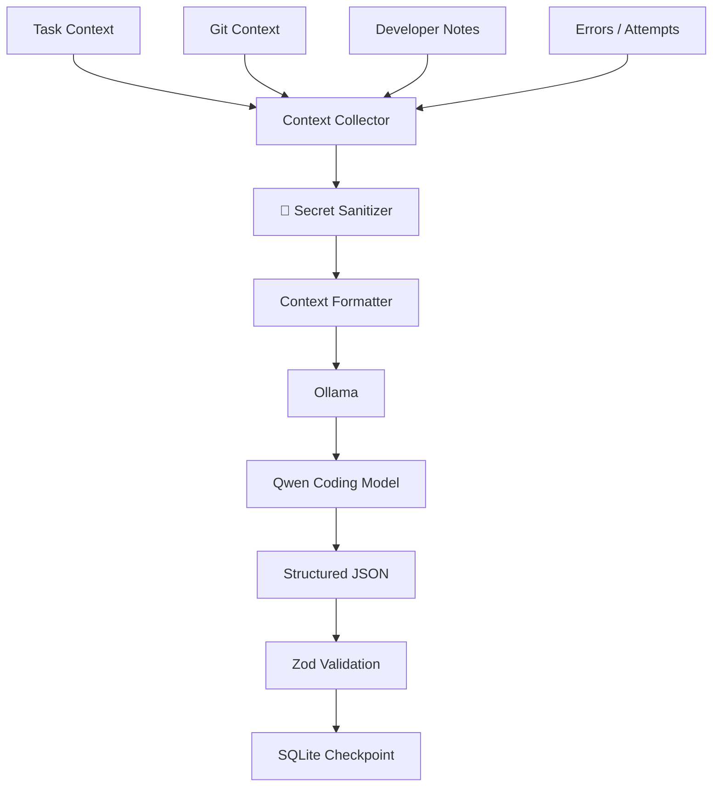
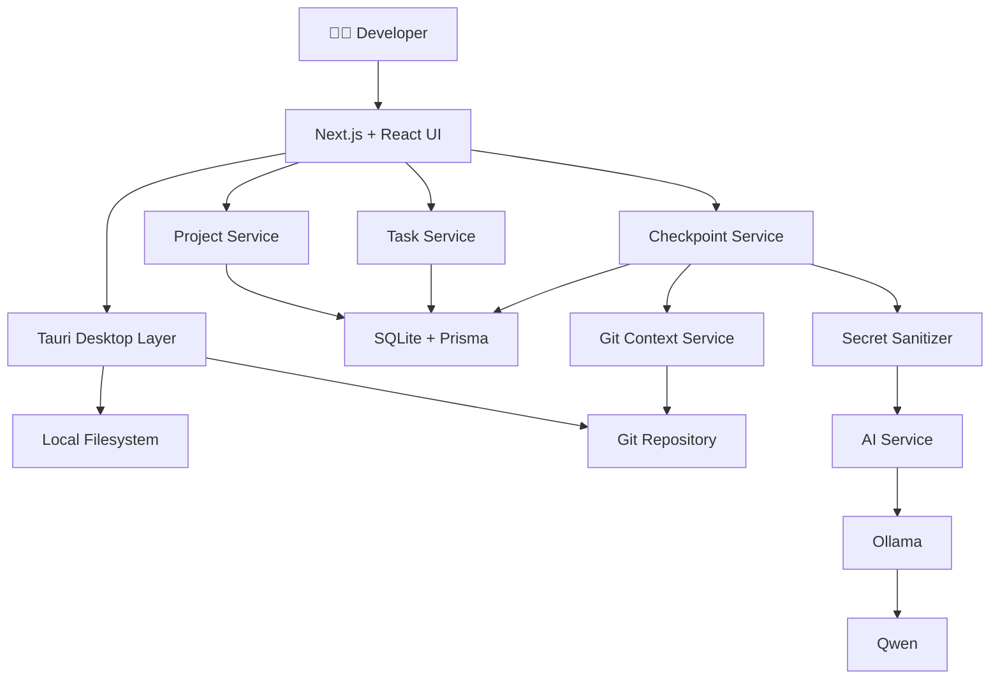
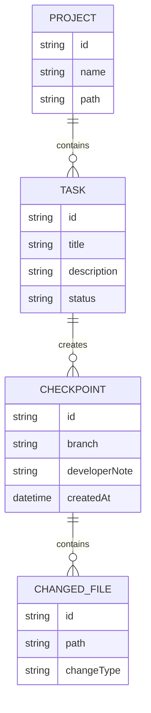

<div align="center">

# ⚡ DevCheckpoint

### Your development context, saved.


<br/>

**A local-first developer productivity tool that remembers what you were working on,  
what changed, what broke, what you already tried, and what you should do next.**

<br/>

[](#-hackathon-track)
[](#-hackathon-track)
[](#-privacy--local-first)
[](https://tauri.app/)
[](https://nextjs.org/)
[](https://www.typescriptlang.org/)

<br/>

</div>

---

# 🧠 What is DevCheckpoint?

Developers don't only lose time writing code.

They lose time **remembering what they were doing**.

You might be debugging an authentication issue, get interrupted by a production bug, attend a meeting, switch repositories, or simply return the next morning.

Git can tell you:

```text
3 files changed
17 insertions
6 deletions
```

But it usually cannot tell you:

```text
Why did I change those files?
What exactly was broken?
What have I already tried?
Which files actually matter?
What was I planning to do next?
```

**DevCheckpoint fills that gap.**

It creates a structured checkpoint of your current development state so you can return later and continue without reconstructing your entire mental context.

> ### Git saves your code. DevCheckpoint saves your working context.

---

# 🎯 The Problem

Imagine you're debugging a Stripe webhook.

You have already:

- changed the webhook handler
- tested a different endpoint secret
- inspected request headers
- modified middleware
- discovered that signature verification is still failing

Then an urgent production issue appears.

You switch tasks.

Three hours later, you return.

Git shows the files you changed.

But the reasoning behind those changes is gone.

You now spend another 15–30 minutes rebuilding the context in your head.

DevCheckpoint is designed to eliminate that restart cost.

---

# ⚡ Core Workflow

```mermaid
flowchart LR
    A["📁 Select Repository"]
    B["🎯 Start Task"]
    C["💻 Work Normally"]
    D["💾 Save Checkpoint"]
    E["🌿 Collect Git Context"]
    F["🔐 Sanitize Context"]
    G["🤖 Local AI Summary"]
    H["🗄️ Save Locally"]
    I["▶ Resume Development"]

    A --> B
    B --> C
    C --> D
    D --> E
    E --> F
    F --> G
    G --> H
    H --> I
```



The current interactive demo already supports the core workflow without requiring the AI layer to be complete.

---

# ✨ What DevCheckpoint Captures

A checkpoint can preserve:

| Context | Example |
|---|---|
| 🎯 Current task | Fix Stripe webhook verification |
| 🌿 Git branch | `feature/stripe-webhook` |
| 📝 Changed files | `webhook.ts`, `stripe.ts`, `middleware.ts` |
| 🔀 Git diff | Real working-tree changes |
| 📜 Recent commits | Latest repository history |
| 🚧 Current blocker | Signature verification failing |
| 🧪 Attempts | Changed endpoint secret, checked headers |
| 🗒️ Developer notes | Raw body may be modified by middleware |
| 📂 Important files | Files most relevant to the task |
| ➡️ Next step | Verify raw request body handling |

---

# 🖥️ Product Preview

> Add approved DevCheckpoint screenshots inside `docs/assets/` or `design/references/` and update the paths below.

<div align="center">

### Dashboard


<br/><br/>

### Project Workspace


<br/><br/>

### Save Checkpoint


<br/><br/>

### Resume Development


</div>

---

# 🚀 Current Demo Features

## ✅ Working

### 📁 Local Repository Selection

DevCheckpoint can open a native folder picker and allow the developer to choose a local repository.

It validates whether the selected directory is a real Git repository before registering it.

---

### 🌿 Real Git Context

Using read-only Git integration, DevCheckpoint can collect:

```text
Repository name
Current branch
Git status
Modified files
Staged files
Added files
Deleted files
Per-file changes
Git diff
Recent commits
```

Git access is intentionally **read-only**.

DevCheckpoint does not automatically:

```text
commit
push
pull
checkout
reset
merge
rebase
stash
clean
```

---

### 🎯 Task Management

Developers can create tasks containing:

```text
Title
Description
Project
Branch
Notes
Status
Timestamps
```

Supported statuses:

```text
ACTIVE
PAUSED
COMPLETED
```

---

### 💾 Local Checkpoints

A developer can save their current working state.

A checkpoint records:

```text
Task
Project
Branch
Git status
Changed files
Git diff
Recent commits
Developer note
Timestamp
```

The checkpoint is persisted locally.

---

### ▶ Resume Development

A developer can return later and load the latest checkpoint for a task.

The current demo supports:

```text
Add Repository
      ↓
Start Task
      ↓
Modify Code
      ↓
Save Checkpoint
      ↓
Close DevCheckpoint
      ↓
Open DevCheckpoint Again
      ↓
Resume Task
```

---

### 🤝 Developer Handoffs

DevCheckpoint can generate a structured handoff from saved task context.

Example:

```text
Task:
Fix Stripe webhook verification

Branch:
feature/stripe-webhook

Current state:
Webhook endpoint is receiving requests.

Problem:
Stripe signature verification is failing.

Relevant files:
- webhook.ts
- stripe.ts
- middleware.ts

Developer note:
Need to verify whether middleware changes the raw request body.
```

This can later be expanded into richer team collaboration.

---

# 🤖 Local AI Layer

The planned intelligence layer runs locally using:

<div align="center">


</div>

The intended AI pipeline is:



The model will return structured data similar to:

```json
{
  "task": "Fix Stripe webhook verification",
  "changes": [
    "Updated webhook handler",
    "Modified Stripe middleware"
  ],
  "blocker": "Stripe signature verification is failing",
  "attempts": [
    "Changed webhook secret",
    "Checked request headers"
  ],
  "importantFiles": [
    "src/api/webhook.ts",
    "src/lib/stripe.ts"
  ],
  "nextStep": "Verify that the raw request body reaches Stripe unchanged"
}
```

---

# 🔐 Privacy & Local-First

DevCheckpoint is designed around one major principle:

> **Your code should not need to leave your computer just to remember what you were doing.**

The architecture is local-first.

### Local by default

- Repository analysis happens locally
- Git operations happen locally
- Checkpoints are stored locally
- SQLite is stored in the OS application-data directory
- AI is designed to run through local Ollama
- No cloud AI is required for the MVP
- No telemetry is required

### Sensitive data protection

DevCheckpoint is designed to exclude or redact:

```text
.env
.env.*
*.pem
*.key
SSH keys
Private keys
API keys
Access tokens
Refresh tokens
Passwords
Database credentials
Credential files
```

Sensitive values are intended to become:

```text
[REDACTED]
```

before they are passed into an AI context package.

---

# 🏗️ Architecture



---

# 🛠️ Tech Stack

## Desktop


## Frontend


## Database


## Developer Context


```text
simple-git
Git CLI
```

## AI

```text
Ollama
Qwen
Zod
```

---

# 📂 Project Structure

```text
devcheckpoint/
│
├── src/
│   │
│   ├── app/
│   │   ├── projects/
│   │   ├── tasks/
│   │   ├── checkpoints/
│   │   ├── handoffs/
│   │   ├── analytics/
│   │   └── settings/
│   │
│   ├── components/
│   │   ├── layout/
│   │   ├── projects/
│   │   ├── tasks/
│   │   ├── checkpoints/
│   │   ├── handoffs/
│   │   ├── git/
│   │   └── ui/
│   │
│   └── lib/
│       ├── actions/
│       ├── git/
│       ├── context/
│       └── db/
│
├── prisma/
│   ├── schema.prisma
│   └── migrations/
│
├── src-tauri/
│   ├── src/
│   ├── capabilities/
│   └── tauri.conf.json
│
├── design/
├── docs/
│
├── ARCHITECTURE.md
├── AGENT_RULES.md
└── package.json
```

---

# 🗄️ Core Data Model



---

# 🎨 Design Philosophy

DevCheckpoint uses a premium dark developer interface inspired by the quality and restraint of modern developer products.

The design principles are:

```text
Linear-level density
Vercel-level restraint
GitHub-level familiarity
IDE-level technical clarity
```

The application intentionally avoids looking like a generic AI chatbot.

AI is a supporting layer.

The development workflow remains the primary interface.

---

# 🧪 Example Use Case

### Before interruption

```text
Task:
Fix authentication refresh flow

Problem:
Refresh token returns 401 after access token expiry

Already tried:
- Changed JWT expiry
- Checked refresh endpoint
- Verified token generation

Important files:
- auth.ts
- jwt.ts
- middleware.ts

Next:
Inspect cookie SameSite configuration
```

Developer clicks:

```text
Save Checkpoint
```

Then switches to another issue.

---

### Several hours later

Developer opens DevCheckpoint.

Clicks:

```text
Resume Development
```

And immediately gets:

```text
You were fixing refresh-token authentication.

Login currently works.

Refresh-token validation is returning 401.

You already checked JWT expiry and token generation.

Relevant files:
auth.ts
jwt.ts
middleware.ts

Next step:
Inspect cookie SameSite / Secure configuration.
```

No reconstruction required.

---

# 🗺️ Roadmap

### Phase 1 — Foundation

- [x] Product architecture
- [x] Technical requirements
- [x] UI/UX system
- [x] Tauri desktop shell
- [x] Next.js application
- [x] SQLite / Prisma

### Phase 2 — Core Developer Workflow

- [x] Local repository selection
- [x] Git repository validation
- [x] Branch detection
- [x] Git status
- [x] Changed files
- [x] Git diff
- [x] Recent commits
- [x] Task management

### Phase 3 — Checkpoints

- [x] Raw checkpoint capture
- [x] Local persistence
- [x] Resume Development
- [x] Basic handoff generation

### Phase 4 — Local Intelligence

- [ ] Secret sanitizer
- [ ] Ollama runtime integration
- [ ] Qwen checkpoint summaries
- [ ] Structured Zod validation
- [ ] AI-generated blockers / attempts / next steps

### Phase 5 — Automation

- [ ] Lightweight file monitoring
- [ ] Error context capture
- [ ] Command history capture
- [ ] Smarter context prioritization

### Phase 6 — Platform & Polish

- [ ] macOS validation
- [ ] Windows packaging
- [ ] macOS packaging
- [ ] Search across checkpoints
- [ ] Performance improvements
- [ ] Accessibility review

---

# 🏆 Hackathon Track

### Track 3 — Developer Tooling

**Subtrack:** Workflow & Context Management

The challenge focuses on tools that reduce developer context switching and help developers stay productive inside complex development environments.

DevCheckpoint approaches that problem by creating a persistent memory layer around development tasks.

---

# 🚫 What DevCheckpoint Is Not

DevCheckpoint is **not**:

```text
❌ A replacement for Git
❌ A replacement for GitHub
❌ Another IDE
❌ Another code-generation chatbot
❌ A fully autonomous coding agent
```

It complements tools developers already use.

Think of it as:

> **A save-state system for software development.**

---

# 💡 Why This Matters

Software development contains a huge amount of temporary knowledge.

Most of it never reaches:

```text
Git
Documentation
Tickets
Pull requests
Comments
```

It exists temporarily inside the developer's head.

DevCheckpoint turns that temporary context into a reusable development state.

---

# 🔮 Future Vision

DevCheckpoint can eventually become a broader **developer context layer** that works across:

```text
VS Code
Cursor
Claude Code
GitHub
GitLab
Jira
Linear
Terminal
CI/CD
Local AI models
```

A future developer should be able to say:

```text
Resume the payment bug I was working on Tuesday.
```

and immediately recover the entire relevant working state.

---

# 🧑‍💻 Running Locally

## Requirements

```text
Node.js 22+
pnpm
Git
Rust
Cargo
Tauri prerequisites
SQLite
```

Optional for upcoming AI features:

```text
Ollama
Qwen coding model
```

---

## Clone

```bash
git clone https://github.com/ananyaa0204/DevCheckpoint-CortexCrafters.git
```

```bash
cd DevCheckpoint-CortexCrafters/devcheckpoint
```

---

## Install dependencies

```bash
pnpm install
```

---

## Run the web frontend

```bash
pnpm dev
```

---

## Run the desktop application

```bash
pnpm tauri dev
```

The first Tauri compilation may take longer because Rust dependencies must be compiled.

---

# 🔒 Git Safety

DevCheckpoint currently treats Git repositories as **read-only context sources**.

Allowed operations include:

```bash
git status
git branch --show-current
git diff
git diff --cached
git log
```

DevCheckpoint does not automatically execute destructive repository commands.

---

# 🤝 Team

<div align="center">

## CortexCrafters

Building a better way for developers to stop, switch and resume without losing context.

</div>

---

# 📜 License

This project is licensed under the **MIT License**.

See:

```text
LICENSE
```

for details.

---

<div align="center">

<br/>

## ⚡ DevCheckpoint

### Stop coding. Switch tasks. Come back without starting over.


<br/>

**Built by CortexCrafters**

</div>
