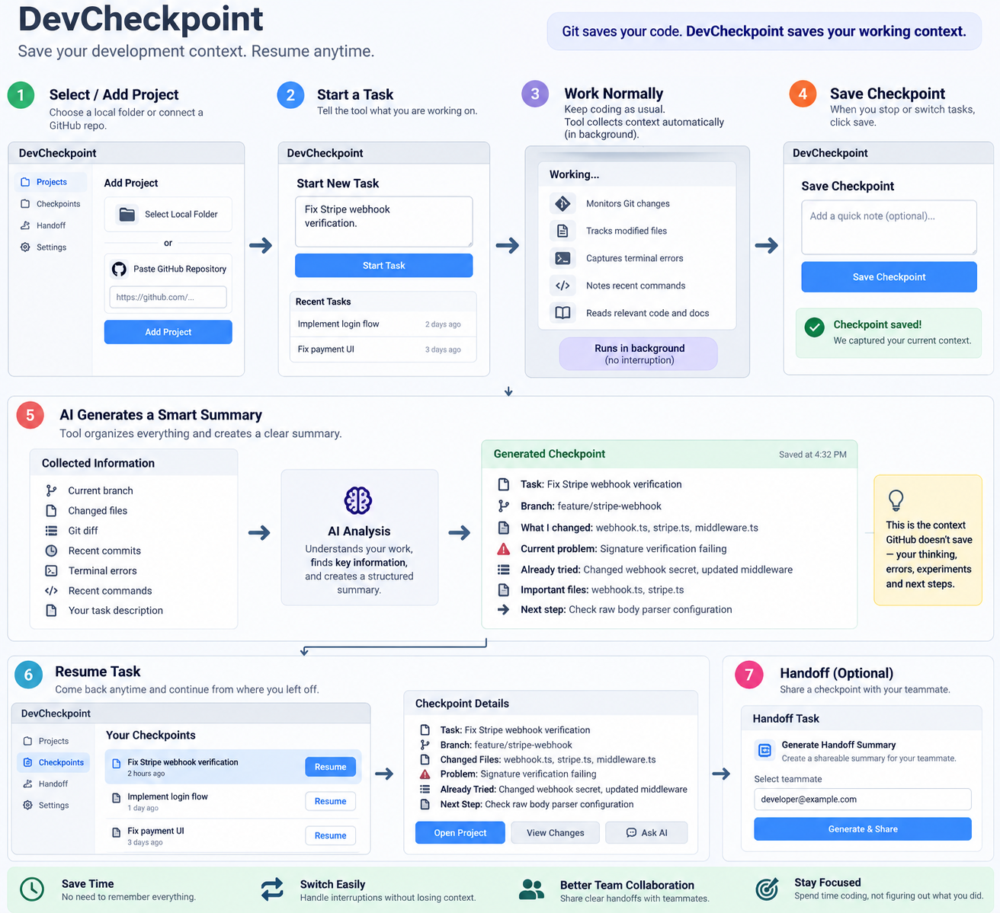

# DevCheckpoint

> **Git saves your code. DevCheckpoint saves the context around your code.**

DevCheckpoint is a **local-first developer productivity tool** for saving and restoring the working context around a coding task. It is designed for the moments where Git history alone is not enough: interruptions, task switching, debugging sessions, unfinished experiments, and developer handoffs.

A checkpoint captures the task, the real Git state of the selected repository (branch, changed/staged files, diff, recent commits), and a developer note. If a local Ollama model is running, it also generates a structured AI summary (what changed, current blocker, what's been tried, important files, next step) — but the checkpoint always saves even when Ollama isn't available.



## Why DevCheckpoint?

Git is excellent at recording code history, but it does not always preserve the full short-term development context around unfinished work. A developer may know which files changed but still need to reconstruct:

- What was I trying to achieve?
- What was currently broken?
- What approaches had I already tried?
- Which files mattered most?
- What was I going to do next?

DevCheckpoint focuses on that missing workflow context.

## Core Workflow

```text
Add Local Repository (native folder picker, validated as a Git repo)
        ↓
Start Task
        ↓
Work Normally
        ↓
Save Checkpoint
        ↓
Collect real Git + Task Context
        ↓
Sanitize Sensitive Data (before it's ever stored or sent to Ollama)
        ↓
Local AI Summary via Ollama + Qwen (skipped gracefully if unavailable)
        ↓
Validate Structured Output with Zod
        ↓
Store in SQLite
        ↓
Resume Development Later → Create Handoff
```

## What's Implemented

- Native folder picker (Tauri) → validates the selection as a real Git repository, with clear errors for invalid folders
- Real, read-only Git integration (`simple-git`): current branch, status, changed/staged files with insertion/deletion counts, per-file diffs, and the last 5 commits — never a Git write operation
- Task management: create tasks per project, move between `ACTIVE` / `PAUSED` / `COMPLETED`
- Checkpoints: capture task + live Git context + a developer note, sanitize it, persist it to SQLite — always, even if AI generation is skipped or fails
- Local AI checkpoint summaries via Ollama + a local Qwen model: availability check, model check, JSON-only prompting, Zod validation, one repair-retry on malformed output, and a Generate/Regenerate action. No cloud AI provider exists anywhere in the app
- Resume Development: shows what you were doing, where you stopped, what you tried, important files, and next step (from the AI summary when available, from raw Git/note data otherwise), plus whether the repository has changed since the checkpoint
- Handoffs: generate and save a Markdown handoff (Task / Current Status / Branch / Changes / Blocker / Already Tried / Important Files / Next Recommended Step / Git Context), with copy and local save — no cloud sharing
- Lightweight context capture: a Chokidar watcher scoped to the selected repository (only while a task is active) for recent file-activity metadata, plus manual Command/Error log entries per task
- Secret sanitization: `.env`/keys/credentials/SSH-AWS-GPG paths are never read (excluded at the Git pathspec level), and API keys/tokens/passwords/Authorization headers/PEM blocks are redacted from anything before it's saved or sent to Ollama
- Settings: Ollama endpoint/model with a working Test Connection check, secret-redaction toggle, the always-ignored directory list, and a Developer panel showing the real app-data path/version/platform
- Reasonable limits so a large repository stays responsive: diffs and changed-file lists are capped and truncation is surfaced in the UI; developer notes are capped at 5,000 characters

## Not Implemented / Known Limitations

- No automatic terminal/command hooking — command and error entries are pasted in manually by design (see `AGENT_RULES.md`)
- No cloud AI, cloud sync, authentication, or team/multi-user features — this is intentionally single-user and local-only
- Production packaging (bundling migrations into an installed app rather than running from the source tree) is not set up yet
- Automated tests cover the security sanitizer, AI schema/generation fallback, context formatting, and Git parsing helpers — not full UI/E2E coverage
- Developed and verified on Windows; the code is written to be cross-platform (Node `path` APIs throughout, no OS-specific branches or hardcoded paths), but macOS has not been executed against in this environment

## Local-First by Design

- Local repositories are accessed only after explicit user selection — never scanned automatically
- SQLite stores project/task/checkpoint/handoff data in the OS application-data directory (via `env-paths`), not a hardcoded path
- Ollama runs the AI model locally; there is no cloud fallback
- `.env`, credentials, private keys, tokens, and secret-like values are excluded or redacted before anything is persisted or sent to Ollama
- Git operations used for context collection are read-only

See [SECURITY.md](SECURITY.md) and [docs/PRIVACY_MODEL.md](docs/PRIVACY_MODEL.md).

## Technology Stack

| Area | Technology |
|---|---|
| Desktop | Tauri (+ `@tauri-apps/plugin-dialog` for native folder selection) |
| Frontend | Next.js, React, TypeScript |
| Styling | Tailwind CSS, shadcn/ui, lucide-react, sonner |
| Database | SQLite (per-OS app-data directory) |
| ORM | Prisma (`better-sqlite3` driver adapter) |
| Git | Git CLI, simple-git |
| File monitoring | Chokidar |
| Local AI | Ollama + Qwen coding model (`qwen2.5-coder:7b` by default) |
| Validation | Zod |
| Testing | Vitest |

## Architecture

```text
Tauri window
  └─ Next.js App Router UI (Server Components + Server Actions)
       ├─ src/lib/git       read-only Git context via simple-git
       ├─ src/lib/security  sensitive-path exclusion + secret redaction
       ├─ src/lib/ai        Ollama client, prompt builder, Zod schema, generator
       ├─ src/lib/watch     per-project Chokidar file-activity tracking
       ├─ src/lib/actions   Server Actions (projects, tasks, checkpoints, handoffs, settings)
       └─ src/lib/db        Prisma client + OS app-data path resolution
```

Every save path runs: capture → sanitize → (optionally) summarize with Ollama → validate → persist. See [ARCHITECTURE.md](ARCHITECTURE.md) and [AGENT_RULES.md](AGENT_RULES.md) for the full design constraints this implementation follows.

## Hackathon Track

**HackBattle 2026**
**Track 3 — Developer Tooling**
**Subtrack — Workflow & Context Management**

The project directly targets developer context switching by preserving task state and making it easy to resume work after an interruption.

See [HACKATHON.md](HACKATHON.md) for the alignment summary.

## UI Direction

DevCheckpoint uses a premium dark developer-tool interface with:

- Linear-level information density
- Vercel-like restraint
- GitHub-like developer familiarity
- IDE-style technical clarity

Approved UI references are stored in [`design/references/`](design/references/).


## Documentation

### Product & Architecture

- [Architecture](ARCHITECTURE.md)
- [Agent Rules](AGENT_RULES.md)
- [Product Overview](docs/PRODUCT_OVERVIEW.md)
- [User Flow](docs/USER_FLOW.md)
- [Backend Schema](docs/DevCheckpoint_Backend_Schema_Document.docx)
- [Technical Requirements](docs/DevCheckpoint_Technical_Requirements_Document.docx)
- [Product Requirements](docs/DevCheckpoint_PRD.docx)

### AI & Local Model

- [AI Flow](docs/AI_FLOW.md)
- [AI Output Schema](docs/AI_OUTPUT_SCHEMA.md)
- [Local LLM Setup](docs/LOCAL_LLM_SETUP.md)
- [Privacy Model](docs/PRIVACY_MODEL.md)

### Design

- [Design System](design/DESIGN_SYSTEM.md)
- [UI Implementation Guide](design/UI_IMPLEMENTATION.md)
- [Component Map](design/COMPONENT_MAP.md)
- [Claude Frontend Prompt](design/CLAUDE_FRONTEND_PROMPT.md)
- [Screen Map](docs/SCREEN_MAP.md)

## Development Setup

macOS: see [SETUP.md](SETUP.md). Windows: see [SETUP_WINDOWS.md](SETUP_WINDOWS.md).

```bash
pnpm install
pnpm exec prisma generate
pnpm tauri dev
```

### Ollama / Qwen (optional but recommended)

```bash
ollama serve
ollama pull qwen2.5-coder:7b
```

DevCheckpoint works fully without Ollama running — checkpoints just save without an AI summary, which you can generate later from Settings once Ollama is up. Configure the endpoint/model in Settings if you're using a different port or model.

### Checks

```bash
pnpm run typecheck
pnpm run lint
pnpm test
```

## Demo Flow

1. Add a real local Git repository (native folder picker validates it).
2. Start a task, e.g. "Fix Stripe webhook verification."
3. Open Project Workspace — real branch, changed files, diff, and recent commits.
4. Save a checkpoint with a developer note; Ollama (if running) generates a structured summary.
5. Close DevCheckpoint entirely, reopen it — the task and checkpoint are still there.
6. Click **Resume Development** — task, blocker, attempts, important files, and next step appear immediately.
7. Generate and save a **Handoff**, copy the Markdown.

## Contribution

See [CONTRIBUTING.md](CONTRIBUTING.md).

## License

MIT — see [LICENSE](LICENSE).
